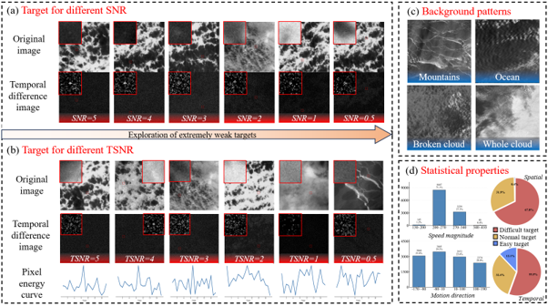
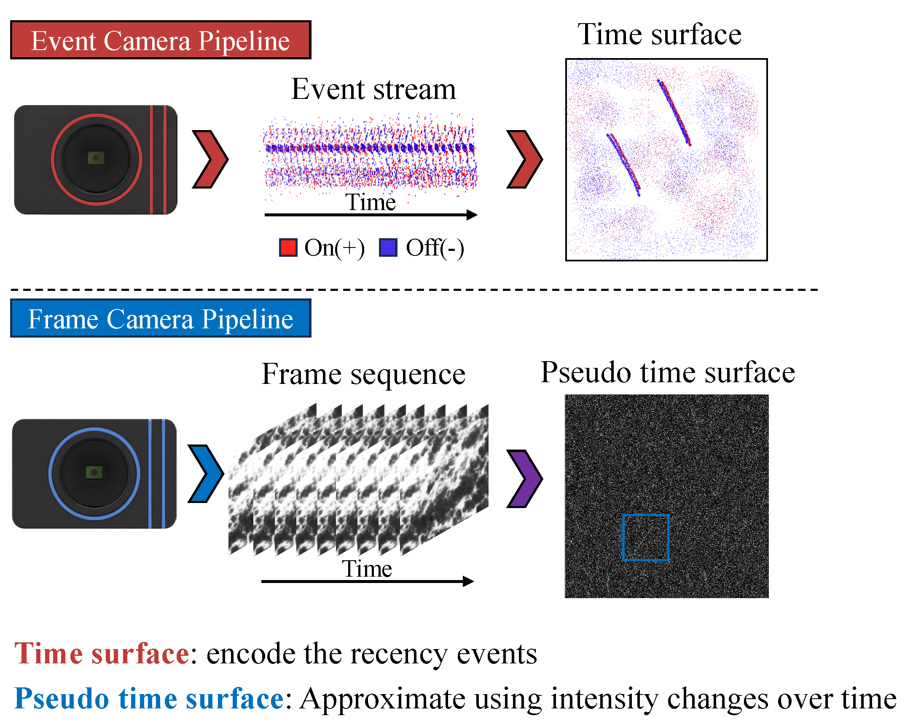
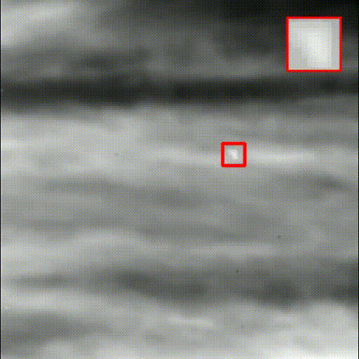
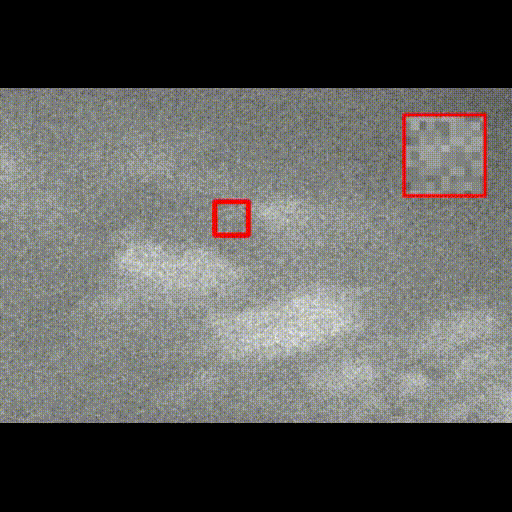

<div align="center">


<p align="center">
  
</p>

</div>

## 🔗 Quick Link
Try our:

🗂️[HIT-EWIRSTD](https://pan.baidu.com/s/19FWo0dn7FMTA0YJ7FJ3L0g?pwd=3q97)
Dataset
<p align="left">
  
</p>

🧰[Statistical-Toolbox-for-SNR-and-TSNR-of-Motion-IRSTD](https://github.com/MYQHY/Statistical-Toolbox-for-SNR-and-TSNR-of-Motion-IRSTD)

## 🔥 Overview

<p align="center">
  
</p>

**YourProjectName** is a robust and efficient framework for **[your task, e.g., RGB-Event spacecraft pose estimation / remote sensing object detection / infrared small target detection]**.

It is designed to address the following challenges:

- 🌗 **Extreme illumination variation**
- 🛰️ **Complex space / remote sensing scenarios**
- 🎯 **Small, weak, or non-cooperative targets**
- 🔄 **Cross-domain generalization**
- ⚡ **Efficient deployment on edge devices**

---

## 📢 News

- **2026-06-10**: 🚀 Project page is online.


---

## ✨ Highlights

### 🌗 Innovative ideas inspired by event sensors



### 🧠 Break through the existing upper limit of extremely weak target detection capability

### 🧩 Broader applicability

### ⚡ Efficient and Reproducible


## 🎬 Demo

<table>
  <tr>
    <td align="center" width="33%">
      
      <br>
      <b>NUDT-MIRSDT</b>
    </td>
    <td align="center" width="33%">
      
      <br>
      <b>NUDT-MIRSDT-HiNo(Invisible to the naked eye)</b>
    </td>
    <td align="center" width="33%">
      
      <br>
      <b>HIT_EWIRSTD(Invisible to the naked eye)</b>
    </td>
  </tr>
</table>


## 🏆 Main Results

### Comparison with State-of-the-Art Methods

### Quantitative comparison on different infrared small target datasets

> **Pd ↑**: higher is better. **Fa ↓**: lower is better.

| Category | Type | Method | NUDT-MIRSDT(SNR≤3) Pd↑ | NUDT-MIRSDT(SNR≤3) Fa↓ | NUDT-MIRSDT Pd↑ | NUDT-MIRSDT Fa↓ | NUDT-MIRSDT-HiNo Pd↑ | NUDT-MIRSDT-HiNo Fa↓ | IRDST Pd↑ | IRDST Fa↓ | HIT\_EWIRSTD Pd↑ | HIT\_EWIRSTD Fa↓ |
| :---: | :---: | :--- | ---: | ---: | ---: | ---: | ---: | ---: | ---: | ---: | ---: | ---: |
| Traditional Methods | Single-frame | TopHat | 2.08 | 5380.38 | 14.92 | 2166.55 | 1.45 | 78.16 | 20.27 | 409.52 | 2.02 | 523.82 |
| Traditional Methods | Single-frame | MAXMEAN | 14.12 | 255.29 | 21.92 | 193.24 | 4.68 | 393.16 | 31.12 | 59.61 | 9.32 | 1030.41 |
| Traditional Methods | Single-frame | WSLCM | 0 | 323.86 | 30.83 | 1293.31 | 27.01 | 493.93 | 35.28 | 102.12 | 5.90 | 1452.63 |
| Traditional Methods | Single-frame | PSTNN | 2.27 | 115.16 | 27.87 | 98.03 | 0.58 | 40.31 | 33.91 | 30.37 | 0.01 | 2.63 |
| Traditional Methods | Single-frame | RLCM | 2.31 | 49.04 | 10.32 | 32.98 | 9.37 | 393.97 | 12.04 | 42.87 | 8.03 | 988.73 |
| Traditional Methods | Multi-frame | SRSTT | 62.95 | 28.74 | 87.39 | 16.10 | 4.34 | 83.28 | 40.12 | 336.88 | 3.25 | 445.91 |
| Traditional Methods | Multi-frame | NFTDGSTV | 29.62 | 65.21 | 33.26 | 44.94 | 11.56 | 43.16 | 30.87 | 441.09 | 6.72 | 336.01 |
| Traditional Methods | Multi-frame | RCTVW | 57.82 | 143.74 | 67.56 | 122.71 | 6.53 | 2165.84 | 52.95 | 884.21 | 9.27 | 746.12 |
| Traditional Methods | Multi-frame | ASTTVNTLA | 0.95 | 92.20 | 2.89 | 37.42 | 4.63 | 58.80 | 10.32 | 33.04 | 5.17 | 392.13 |
| Traditional Methods | Multi-frame | STPA-FCTN | 73.06 | 103.24 | 78.33 | 91.64 | 10.35 | 415.24 | 66.38 | 125.53 | 21.39 | 394.01 |
| Deep Learning Methods | Single-frame | HCFNet | 49.95 | 51.14 | 79.77 | 52.93 | 30.26 | 559.50 | 70.13 | 44.32 | 14.92 | 521.39 |
| Deep Learning Methods | Single-frame | UIUNet | 76.22 | **0.38** | 82.67 | 51.17 | 43.67 | 288.70 | 87.58 | 16.90 | 15.42 | 501.75 |
| Deep Learning Methods | Single-frame | DNANet | 83.63 | 65.31 | 92.68 | 34.40 | 24.29 | 252.89 | 81.44 | 11.23 | 18.21 | 491.04 |
| Deep Learning Methods | Single-frame | ALCNet | 75.77 | 12.06 | 89.54 | 131.60 | 19.43 | 136.86 | 75.06 | 12.53 | 12.21 | 959.26 |
| Deep Learning Methods | Single-frame | ACM | 74.84 | 10.91 | 89.80 | 22.14 | 19.95 | 237.20 | 79.51 | 41.22 | 17.13 | 581.42 |
| Deep Learning Methods | Multi-frame | ResUNet | 74.93 | 66.21 | 89.28 | 40.14 | 24.23 | 152.79 | 82.10 | 13.41 | 19.07 | 207.91 |
| Deep Learning Methods | Multi-frame | STDMANet | 92.82 | 28.80 | 96.59 | 34.02 | 51.65 | 19.52 | 98.88 | **0** | 20.21 | 102.39 |
| Deep Learning Methods | Multi-frame | ResUNet+DTUM | 91.68 | 4.11 | 96.45 | 14.26 | 43.90 | 48.60 | 99.48 | **0** | 25.41 | 59.42 |
| Deep Learning Methods | Multi-frame | ResUNet-RFR | 90.39 | 26.79 | 93.35 | 19.51 | 55.64 | 111.23 | 98.90 | 93.65 | 28.21 | 97.70 |
| Deep Learning Methods | Multi-frame | LVNet | 96.24 | 8.34 | 98.82 | 6.28 | 50.13 | 24.76 | 97.62 | 22.31 | 21.67 | 219.05 |
| Deep Learning Methods | Multi-frame | DQAligner | 81.29 | 3.71 | 94.22 | 1.58 | 33.41 | 29.51 | 96.86 | **0** | 44.05 | **0.03** |
| Deep Learning Methods | Multi-frame | LMAFormer | 99.68 | 1.01 | 99.68 | **0.71** | 40.71 | 20.13 | 99.10 | 20.10 | 48.21 | 9.71 |
| Deep Learning Methods | Multi-frame | DeepPro | 95.84 | 5.21 | 98.50 | 7.23 | 59.17 | 17.61 | 99.85 | 1.30 | 22.22 | 200.09 |
| Deep Learning Methods | Multi-frame | **Ours** | **99.74** | 4.57 | **99.91** | 3.33 | **64.06** | **14.30** | **99.97** | 0.64 | **75.95** | 0.10 |


## ⚙️ Installation

### 1. Clone the repository

```bash
git clone https://github.com/yourname/yourrepo.git
cd yourrepo
```

### 2. Create environment

```bash
conda create -n yourproject python=3.8 -y
conda activate yourproject
```

### 3. Install dependencies

```bash
pip install -r requirements.txt
```

### 4. Optional: install CUDA extensions

```bash
cd ops
python setup.py build develop
cd ..
```


## 🚀 Quick Start

### Inference on a single sample

```bash
python tools/infer.py \
    --config configs/ours.yaml \
    --checkpoint checkpoints/ours_best.pth \
    --input demo/sample
```

### Inference on a sequence

```bash
python tools/infer_sequence.py \
    --config configs/ours.yaml \
    --checkpoint checkpoints/ours_best.pth \
    --input demo/sequence_001 \
    --save-dir outputs/sequence_001
```

### Visualize results

```bash
python tools/visualize.py \
    --input outputs/sequence_001 \
    --save-video outputs/demo.mp4
```

---

## 🏋️ Training

### Train on a single GPU

```bash
python tools/train.py \
    --config configs/ours.yaml \
    --work-dir work_dirs/ours
```

### Train on multiple GPUs

```bash
bash scripts/dist_train.sh configs/ours.yaml 4
```

### Resume training

```bash
python tools/train.py \
    --config configs/ours.yaml \
    --work-dir work_dirs/ours \
    --resume checkpoints/latest.pth
```

---

## 📏 Evaluation

### Evaluate pretrained model

```bash
python tools/test.py \
    --config configs/ours.yaml \
    --checkpoint checkpoints/ours_best.pth
```

### Evaluate and save predictions

```bash
python tools/test.py \
    --config configs/ours.yaml \
    --checkpoint checkpoints/ours_best.pth \
    --save-predictions outputs/predictions
```

---

## 📦 Model Zoo

| Model | Dataset | Input Size | Metric-1 ↑ | Metric-2 ↑ | Metric-3 ↓ | Download |
|---|---|---:|---:|---:|---:|---|
| Ours-Tiny | Dataset-A | 256×256 | 80.1 | 73.4 | 8.2 | [Download](https://github.com/yourname/yourrepo/releases) |
| Ours-Base | Dataset-A | 512×512 | 84.7 | 78.5 | 5.9 | [Download](https://github.com/yourname/yourrepo/releases) |
| Ours-Large | Dataset-A + Dataset-B | 512×512 | 86.3 | 80.4 | 5.1 | [Download](https://github.com/yourname/yourrepo/releases) |

---


## 📮 Contact

For questions, discussions, or collaborations, please contact:

```text
24B921001@stu.hit.edu.cn
```

You may also open an issue in this repository.

---

<div align="center">

## Contributors

<table>
  <tr>
    <td align="center">
      <a href="https://github.com/MYQHY">
        
        <br />
        <sub><b>MYQHY</b></sub>
      </a>
      <br />
      <sub>myqq038@gmail.com</sub>
    </td>
    <td align="center">
      <a href="https://github.com/stampliu">
        
        <br />
        <sub><b>stampliu</b></sub>
      </a>
      <br />
      <sub>liuyuxi@connect.hku.hk</sub>
    </td>
        <td align="center">
      <a href="https://github.com/violetmx">
        
        <br />
        <sub><b>violetmx</b></sub>
      </a>
      <br />
      <sub>ll693@outlook.com</sub>
    </td>
  </tr>
</table>


### ⭐ Star this repository if you find it helpful!


</div>

